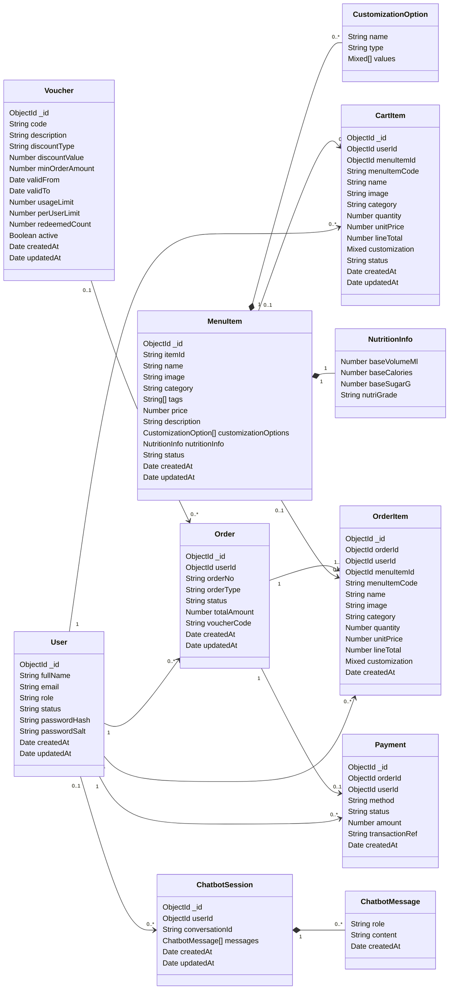

# DripTea Database Class Diagram

A database class diagram shows each stored data object as a class, lists its important fields, and shows how the objects reference each other. For this project, the classes are based on the MongoDB/Mongoose models in `src/models/driptea.models.js`.

## Collections Represented

- `users`
- `menu_items`
- `cart_items`
- `orders`
- `order_items`
- `payments`
- `vouchers`
- `chatbot_sessions`

## Notes

- `CustomizationOption`, `NutritionInfo`, and `ChatbotMessage` are embedded subdocuments, not separate MongoDB collections.
- `CartItem` and `OrderItem` keep copied item details such as `name`, `unitPrice`, and `customization` so historical cart/order records do not depend only on the current menu item.
- `Order.voucherCode` stores the voucher code string instead of a direct `ObjectId` reference to `Voucher`.

## Relationship Rules

- `1` means the record must be linked to exactly one record on that side.
- `0..1` means the link is optional, with at most one linked record.
- `0..*` means zero or many linked records can exist.
- `1..*` means at least one linked record is expected.
- Solid diamond `*--` marks embedded subdocuments stored inside the parent MongoDB document.
