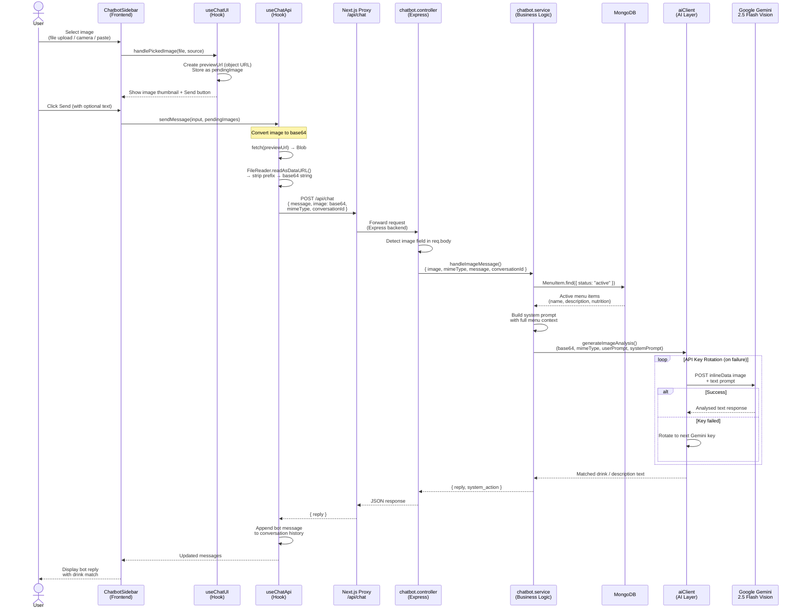

# Sequence Diagram — Image Recognition Flow

## Participants

| Participant | File | Role |
|---|---|---|
| ChatbotSidebar | `view/app/components/chatbot/ChatbotSidebar.tsx` | Image input UI (file / camera / paste) |
| useChatUI | `view/app/components/chatbot/hooks/useChatUI.ts` | Manages pending image state + preview |
| useChatApi | `view/app/components/chatbot/hooks/useChatApi.ts` | Converts image to base64, calls API |
| Next.js Proxy | `view/app/api/chat/route.ts` | Forwards request to Express backend |
| chatbot.controller | `src/controllers/chatbot.controller.js` | Detects image vs text path |
| chatbot.service | `src/services/chatbot.service.js` | Fetches menu, builds prompt |
| MongoDB | — | Stores active menu items |
| aiClient | `src/ai/aiClient.js` | Wraps Gemini API with key rotation |
| Google Gemini | External API | Vision analysis (Gemini 2.5 Flash) |

## Key Behaviours

- **Max 5 images** per message enforced in `useChatUI`
- **Base64 encoding** — images converted from object URL → Blob → base64 before being sent over JSON
- **Menu context injection** — every image request includes all active menu items so Gemini can match the photo to a real drink
- **API key rotation** — `aiClient` cycles through multiple Gemini keys automatically if one fails
- **Graceful fallback** — if all keys fail, the user receives a friendly error message instead of a crash
